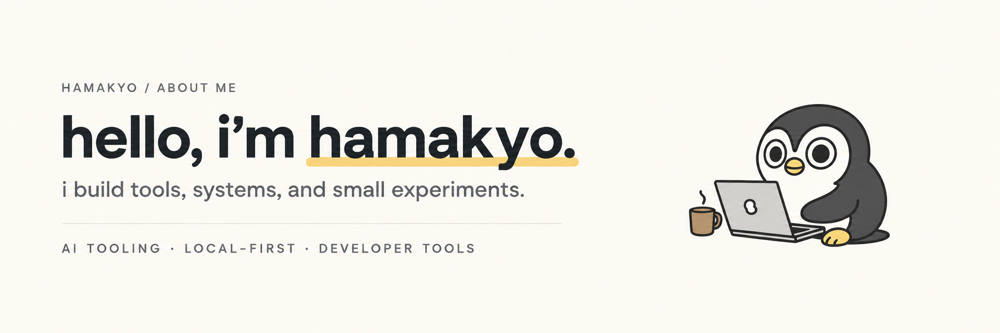
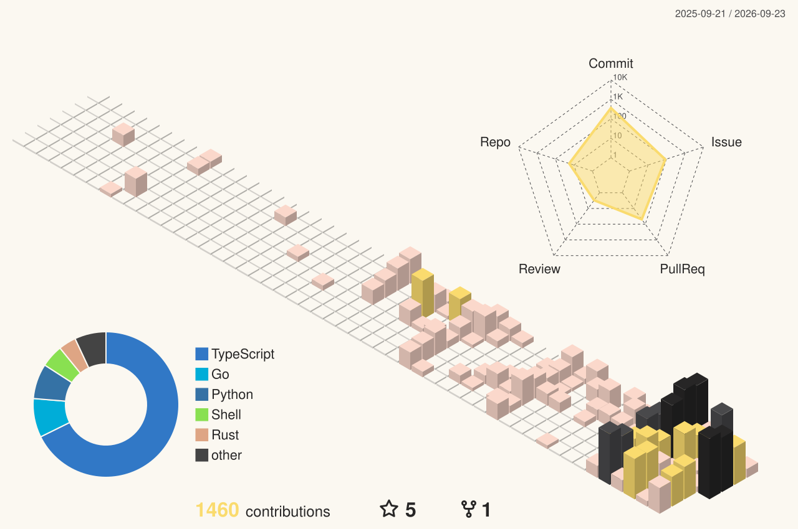

 

 

## what i'm into

I like turning ideas into small working systems.

**AI tooling · developer tools · local-first software · infrastructure · learning systems**

I tend to build things that reduce repetitive work, preserve useful context, or make a fuzzy idea observable enough to improve.

## little shelf of projects

### [jev-starter](https://github.com/hamakyo/jev-starter)

Typed, policy-driven decision workflows on top of TypeSafe AI Jev: confidence routing, fallbacks, evaluation, and RAG patterns for TypeScript apps.

### [okf-skills](https://github.com/hamakyo/okf-skills)

Reusable OKF templates and agent Skills for Codex and Claude Code.

### [jev-mahjong-bench](https://github.com/hamakyo/jev-mahjong-bench)

Reproducible riichi mahjong benchmark for Jev, GPT, Mortal, and hybrid agents using MJAI and RiichiEnv.

### [tilelog-lens](https://github.com/hamakyo/tilelog-lens)

Mahjong Soul screenshot statistics tracker with local OCR and Cloudflare D1 exports.

---

still building. still learning.

