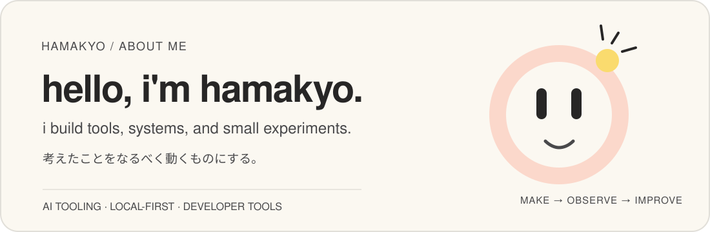

 

## what i'm into

I like turning ideas into small working systems.

**AI tooling · developer tools · local-first software · infrastructure · learning systems**

I tend to build things that reduce repetitive work, preserve useful context, or make a fuzzy idea observable enough to improve.

## little shelf of projects

### [VocabOps](https://github.com/hamakyo/vocabops)
Corpus-driven English vocabulary learning for software engineers, with spaced repetition and habit tracking.

### [OKF Skills](https://github.com/hamakyo/okf-skills)
Reusable project-knowledge templates and agent Skills for Codex, Claude Code, and agent-assisted development.

### [MineDock](https://github.com/hamakyo/minedock)
A Windows-first, local-first library for managing Minecraft Java Edition worlds without treating Docker as a requirement.

### [LPBench](https://github.com/hamakyo/lpbench)
A continuous benchmark for comparing LLM-generated landing pages and web interfaces under repeatable conditions.

### [TileLog Lens](https://github.com/hamakyo/tilelog-lens)
A personal Mahjong Soul stats tracker built around post-game screenshots, trends, comparisons, and data-quality checks.

### [Repolica](https://github.com/hamakyo/repolica)
Self-hosted Git repository replication and disaster recovery, starting with GitHub → GitLab Self-Managed.

## tools i reach for

## activity

 

---

still building. still learning. still becoming.

